# Evaluación Práctica - Seguridad en Redes y Firewalls

Demostración: [YouTube](https://www.youtube.com/watch?v=jkEHIqu6vMM)

---

## 1. Propósito
Implementación y securización de una infraestructura de red empresarial utilizando un firewall de siguiente generación FortiGate con FortiOS 7.0, conmutación de Capa 2 con switch Cisco IOSvL2 y servidores contenerizados en Docker. La arquitectura implementa segmentación de tráfico mediante VLANs bajo el estándar IEEE 802.1Q, traducción de direcciones de red (NAT), filtrado de contenido y ejecutables mediante File Filter en modo Proxy, restricción estricta de salida a Internet mediante FQDNs para servidores y endurecimiento (hardening) del acceso administrativo por SSH.

---

## 2. Topología y Esquema de Direccionamiento
La topología se compone de un segmento de usuarios en la VLAN 10, segmento administrativo en la VLAN 20, segmento de servidores en una subred /28 dentro de la VLAN 30, un switch de distribución Cisco y un firewall perimetral FortiGate conectado a Internet a través del nodo ISP Cloud.

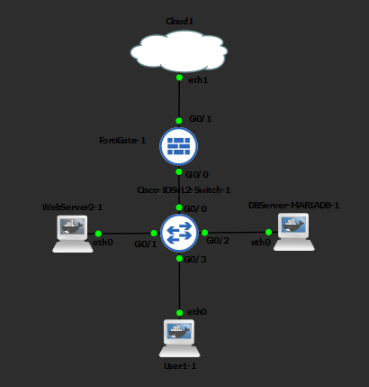

### Plan de Direccionamiento IP

| Red / Segmento | VLAN ID | Subred | Gateway (FortiGate) | Rango Asignable / Hosts | Propósito / Uso |
| :--- | :---: | :--- | :--- | :--- | :--- |
| **VLAN 10 (Usuarios)** | 10 | `10.8.46.0/26` | `10.8.46.1` | `10.8.46.10` - `10.8.46.50` (DHCP) | Puestos de trabajo de usuarios finales |
| **VLAN 20 (Admin)** | 20 | `10.8.46.64/26` | `10.8.46.65` | `10.8.46.66` - `10.8.46.126` | Segmento de gestión administrativa |
| **VLAN 30 (Servidores)** | 30 | `10.8.46.128/28` | `10.8.46.129` | `10.8.46.130` (Web) / `10.8.46.131` (DB) | Zona desmilitarizada / Servidores /28 |
| **Gestión Switch (SVI)** | 10 | `10.8.46.0/26` | `10.8.46.1` | `10.8.46.2` (Estática) | Acceso administrativo SSH al switch |
| **WAN / ISP** | N/A | Dinámica (Cloud) | Asignado por ISP | IP pública / Salida NAT (`port2`) | Conexión externa a Internet |

---

## 3. Implementación y Evidencias por Requisito

### Requisito 2: Salida a Internet y NAT
Se configuró una ruta estática por defecto en el firewall y una política de salida a Internet con NAT para la red de usuarios. El cliente en VLAN 10 obtiene direccionamiento dinámico y valida la salida hacia el exterior mediante pruebas de ping y trazado de rutas.

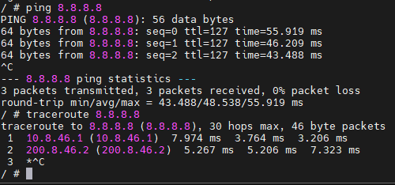

---

### Requisito 3: Servidores sin Internet Abierto (Solo FQDN Updates)
Los servidores no disponen de salida irrestricta a Internet. Se implementó una política que permite únicamente la comunicación con los repositorios de actualización de Ubuntu mediante objetos FQDN (`archive.ubuntu.com` y `security.ubuntu.com`) en HTTP, HTTPS y DNS. Cualquier otra conexión hacia el exterior queda denegada y registrada.

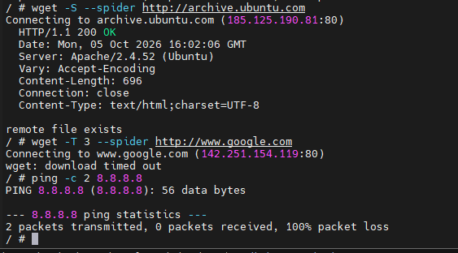
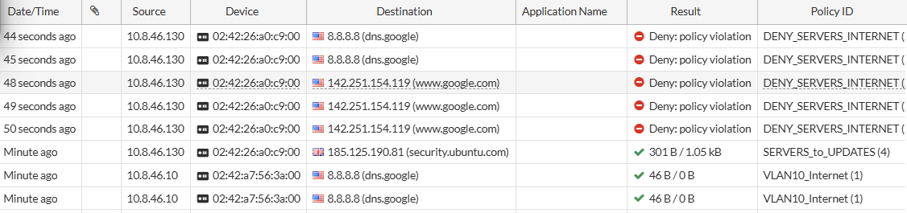

---

### Requisito 4: Servidores Web y Base de Datos
El servidor Web cuenta con el servicio Apache2 operativo en el puerto TCP 80, mientras que el servidor de base de datos mantiene el servicio MariaDB en escucha sobre el puerto TCP 3306, validando la recepción del handshake de conexión local.

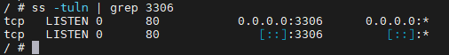
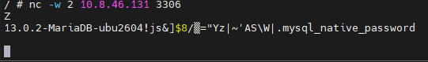

---

### Requisito 5: Bloqueo de Descarga de Archivos .EXE
Se aplicó un perfil de inspección File Filter en modo Proxy sobre la política de navegación web. El firewall autoriza la descarga de archivos convencionales (.txt) y bloquea la transferencia de binarios ejecutables (.exe), generando el registro de evento de seguridad por política.

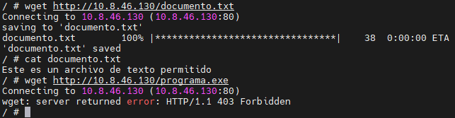
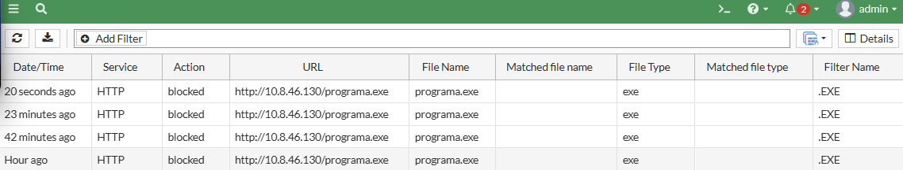

---

### Requisito 6: Acceso Remoto por VTY en Switch Cisco
Se limitó el acceso administrativo del switch Cisco IOSvL2 a las líneas `vty 0 4` exclusivamente, deshabilitando el resto de interfaces virtuales. El transporte se restringió a SSH versión 2 con autenticación local y banner disuasorio de seguridad.

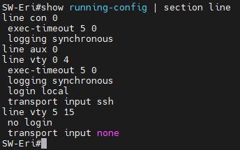
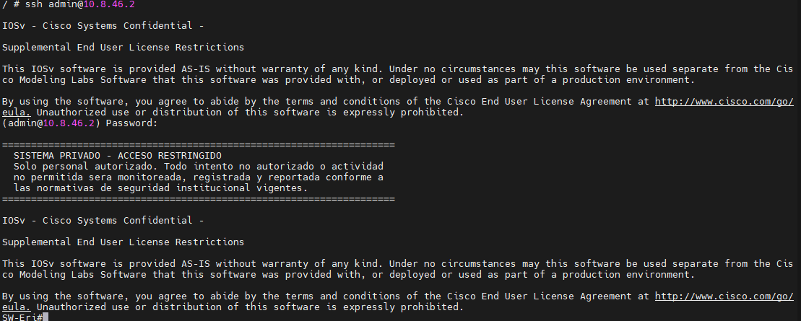

---

### Requisito 7: Acceso Usuarios a Web Server por HTTP Únicamente
Se configuró una política que permite a la VLAN 10 acceder al servidor Web únicamente mediante el puerto HTTP (80). Cualquier otro servicio o protocolo hacia el servidor Web (como ICMP o HTTPS) es denegado explícitamente y registrado en los logs de tráfico.

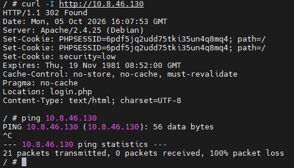
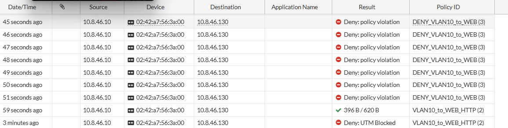

---

### Requisito 9: Segmentación VLANs, Troncal 802.1Q y DHCP
Se crearon las subinterfaces correspondientes en el FortiGate sobre la interfaz física conectada al switch, configurando el enlace troncal 802.1Q en el puerto GigabitEthernet0/0. Se asignaron los hostnames a cada equipo y se validó la entrega de parámetros de red vía DHCP a los puestos de trabajo.

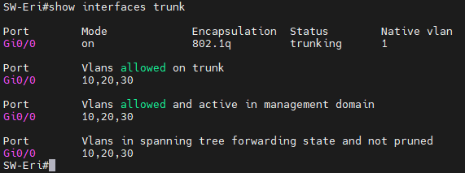
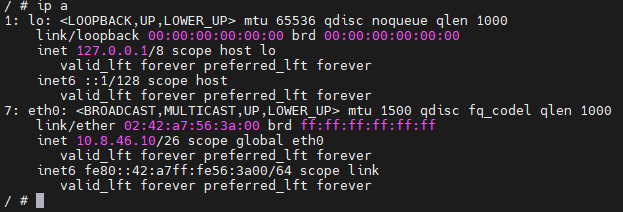
